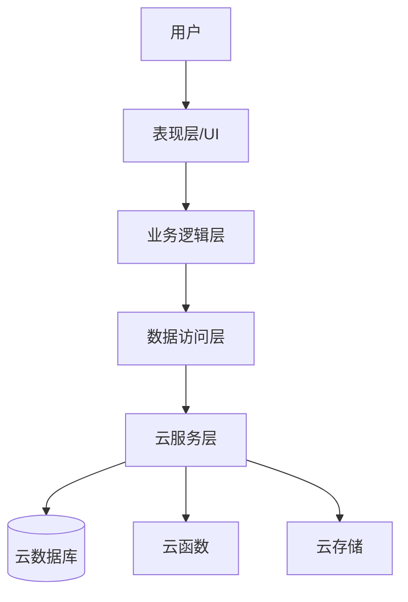
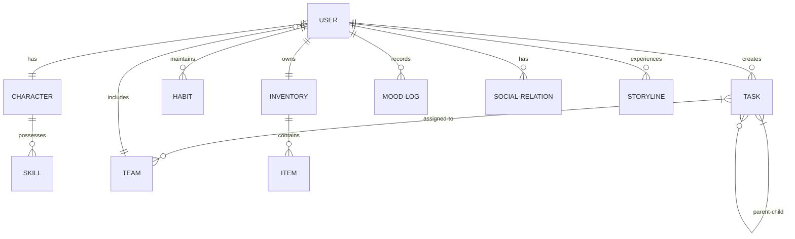

# 设计文档：现实世界RPG

## 概述

"现实世界RPG"是一款将用户日常生活转化为沉浸式角色扮演游戏体验的微信小程序。本设计文档详细描述了系统的架构、组件、数据模型、用户界面以及实现策略，旨在为开发团队提供清晰的技术指导。

本系统基于微信小程序平台开发，使用TDesign组件库构建用户界面，采用模块化设计以确保代码的可维护性和可扩展性。系统将游戏化元素与现实生活任务无缝结合，通过角色扮演、任务系统、社交互动和奖励机制激励用户实现个人目标和培养良好习惯。

## 架构设计

### 整体架构

系统采用前端为主的微信小程序架构，结合云开发能力实现数据存储和用户认证。整体架构分为以下几层：

1. **表现层**：用户界面和交互组件，基于TDesign组件库
2. **业务逻辑层**：实现游戏化逻辑、任务管理、角色系统等核心功能
3. **数据访问层**：处理与云数据库的交互，包括数据的增删改查
4. **云服务层**：利用微信云开发提供数据存储、用户认证和云函数能力



### 模块划分

系统按功能划分为以下主要模块：

1. **角色系统模块**：负责角色创建、属性管理、等级提升和技能树
2. **任务系统模块**：处理任务创建、分类、难度评估和验证

4. **奖励机制模块**：处理经验值、虚拟货币、成就和奖励发放
5. **习惯培养模块**：习惯跟踪、连续计数和数据分析
6. **故事线模块**：个人故事线生成、季节性活动和随机事件
7. **心理健康模块**：情绪追踪、冥想任务和成长反思
8. **学习成长模块**：知识任务、技能证明和导师系统
9. **个性化模块**：AI任务生成和用户适应系统


## 组件和接口设计

### 核心组件

#### 1. 角色管理器（CharacterManager）

负责角色创建、属性计算和等级提升逻辑。

```javascript
// 角色管理器接口
interface CharacterManager {
  // 创建新角色
  createCharacter(userId, characterData);
  // 获取角色信息
  getCharacter(userId);
  // 更新角色属性
  updateAttributes(userId, attributeChanges);
  // 提升角色等级
  levelUp(userId);
  // 解锁技能
  unlockSkill(userId, skillId);
  // 提升技能等级
  upgradeSkill(userId, skillId);
}
```

#### 2. 任务管理器（TaskManager）

处理任务的创建、分类、状态更新和验证。

```javascript
// 任务管理器接口
interface TaskManager {
  // 创建任务
  createTask(userId, taskData);
  // 获取用户任务列表
  getUserTasks(userId, filters);
  // 更新任务状态
  updateTaskStatus(taskId, status);
  // 验证任务完成
  verifyTaskCompletion(taskId, verificationData);
  // 计算任务难度和奖励
  calculateTaskDifficultyAndRewards(taskData);
  // 自动生成任务
  generateAITasks(userId, preferences);
}
```


#### 4. 奖励系统（RewardSystem）

处理各类奖励的发放和管理。

```javascript
// 奖励系统接口
interface RewardSystem {
  // 发放经验值
  grantExperience(userId, amount, source);
  // 发放虚拟货币
  grantCurrency(userId, amount, source);
  // 解锁成就
  unlockAchievement(userId, achievementId);
  // 发放物品奖励
  grantItem(userId, itemId, quantity);
  // 发放现实奖励
  grantRealWorldReward(userId, rewardId);
  // 获取用户库存
  getUserInventory(userId);
}
```


#### 6. 习惯追踪器（HabitTracker）

管理习惯的创建、跟踪和分析。

```javascript
// 习惯追踪器接口
interface HabitTracker {
  // 创建习惯
  createHabit(userId, habitData);
  // 记录习惯完成
  logHabitCompletion(habitId, timestamp);
  // 获取习惯统计
  getHabitStatistics(habitId);
  // 获取连续完成天数
  getStreak(habitId);
  // 分析习惯模式
  analyzeHabitPatterns(userId);
  // 提供习惯建议
  provideHabitSuggestions(userId);
}
```

#### 7. 故事生成器（StoryGenerator）

生成和管理个人故事线和事件。

```javascript
// 故事生成器接口
interface StoryGenerator {
  // 创建个人故事线
  createPersonalStoryline(userId, goals);
  // 生成故事章节
  generateStoryChapter(userId, progress);
  // 创建季节性活动
  createSeasonalEvent(eventData);
  // 触发随机事件
  triggerRandomEvent(userId);
  // 更新故事进度
  updateStoryProgress(userId, milestoneId);
}
```

#### 8. 情绪追踪器（MoodTracker）

跟踪和分析用户情绪状态。

```javascript
// 情绪追踪器接口
interface MoodTracker {
  // 记录情绪
  logMood(userId, moodData);
  // 获取情绪历史
  getMoodHistory(userId, timeRange);
  // 分析情绪趋势
  analyzeMoodTrends(userId);
  // 提供情绪改善建议
  provideMoodImprovementSuggestions(userId);
  // 转换情绪为角色状态
  convertMoodToCharacterStatus(userId, mood);
}
```

### 页面组件结构

系统将包含以下主要页面组件：

1. **首页/仪表盘**：显示角色状态、待完成任务和最近活动
2. **角色页面**：展示角色详情、属性、技能树和装备
3. **任务中心**：任务列表、创建任务和任务详情

5. **探索地图**：基于位置的任务和探索功能
6. **习惯中心**：习惯列表、统计和分析
7. **成就墙**：展示用户获得的成就和徽章
8. **商店**：使用虚拟货币购买虚拟物品
9. **故事书**：展示用户的个人故事线和进度
10. **心理健康中心**：情绪记录、冥想任务和成长报告
11. **学习中心**：知识任务、学习进度和技能证明


## 数据模型

### 核心数据实体

#### 1. 用户（User）

```javascript
{
  _id: String,              // 用户ID
  openid: String,           // 微信OpenID
  nickname: String,         // 昵称
  avatarUrl: String,        // 头像URL
  registrationDate: Date,   // 注册日期
  lastLoginDate: Date,      // 最后登录日期
  settings: Object,         // 用户设置
  statistics: {             // 用户统计数据
    tasksCompleted: Number,
    habitsFormed: Number,
    achievementsUnlocked: Number,
    experienceGained: Number
  }
}
```

#### 2. 角色（Character）

```javascript
{
  _id: String,              // 角色ID
  userId: String,           // 关联的用户ID
  name: String,             // 角色名称
  class: String,            // 职业类型
  level: Number,            // 等级
  experience: Number,       // 经验值
  attributes: {             // 属性值
    strength: Number,       // 体力
    intelligence: Number,   // 智力
    charisma: Number,       // 魅力
    creativity: Number,     // 创造力
    discipline: Number,     // 自律
    vitality: Number        // 活力
  },
  skills: [{                // 技能列表
    id: String,             // 技能ID
    name: String,           // 技能名称
    level: Number,          // 技能等级
    experience: Number,     // 技能经验
    category: String        // 技能类别
  }],
  equipment: [{             // 装备列表
    slot: String,           // 装备槽位
    itemId: String          // 物品ID
  }],
  appearance: Object,       // 外观设置
  status: [{                // 状态效果
    type: String,           // 状态类型
    value: Number,          // 状态值
    expiration: Date        // 过期时间
  }]
}
```

#### 3. 任务（Task）

```javascript
{
  _id: String,              // 任务ID
  creatorId: String,        // 创建者ID
  assigneeIds: [String],    // 指派给的用户ID列表
  title: String,            // 任务标题
  description: String,      // 任务描述
  category: String,         // 任务类别（主线/支线/随机）
  type: String,             // 任务类型
  difficulty: Number,       // 难度级别（1-5）
  rewards: {                // 奖励
    experience: Number,     // 经验值
    currency: Number,       // 虚拟货币
    items: [{               // 物品奖励
      itemId: String,       // 物品ID
      quantity: Number      // 数量
    }],
    attributes: Object      // 属性奖励
  },
  requirements: [{          // 完成要求
    type: String,           // 要求类型
    target: Number,         // 目标值
    current: Number,        // 当前值
    completed: Boolean      // 是否完成
  }],
  verification: {           // 验证方式
    type: String,           // 验证类型（照片/位置/时间）
    data: Object            // 验证数据
  },
  location: {               // 位置信息（可选）
    latitude: Number,
    longitude: Number,
    radius: Number          // 有效半径（米）
  },
  timeConstraints: {        // 时间限制（可选）
    startTime: Date,        // 开始时间
    endTime: Date,          // 结束时间
    duration: Number        // 持续时间（分钟）
  },
  status: String,           // 状态（未开始/进行中/已完成/已失败）
  progress: Number,         // 进度百分比
  createdAt: Date,          // 创建时间
  updatedAt: Date,          // 更新时间
  completedAt: Date,        // 完成时间
  parentTaskId: String,     // 父任务ID（可选）
  childTaskIds: [String],   // 子任务ID列表（可选）
  storyElements: Object     // 故事元素（可选）
}
```

#### 4. 习惯（Habit）

```javascript
{
  _id: String,              // 习惯ID
  userId: String,           // 用户ID
  title: String,            // 习惯标题
  description: String,      // 习惯描述
  category: String,         // 习惯类别
  frequency: {              // 频率设置
    type: String,           // 频率类型（每日/每周/自定义）
    days: [Number],         // 指定天数（周几）
    timesPerDay: Number     // 每天次数
  },
  timePreference: {         // 时间偏好
    startTime: String,      // 开始时间
    endTime: String         // 结束时间
  },
  reminder: Boolean,        // 是否提醒
  reminderTime: String,     // 提醒时间
  skillId: String,          // 关联的技能ID
  streak: {                 // 连续记录
    current: Number,        // 当前连续天数
    best: Number            // 最佳连续天数
  },
  completionLog: [{         // 完成记录
    date: Date,             // 日期
    completed: Boolean,     // 是否完成
    count: Number           // 完成次数
  }],
  createdAt: Date,          // 创建时间
  updatedAt: Date           // 更新时间
}
```

#### 5. 物品（Item）

```javascript
{
  _id: String,              // 物品ID
  name: String,             // 物品名称
  description: String,      // 物品描述
  type: String,             // 物品类型
  rarity: String,           // 稀有度
  effects: [{               // 效果列表
    attribute: String,      // 影响的属性
    value: Number,          // 效果值
    duration: Number        // 持续时间（分钟）
  }],
  imageUrl: String,         // 图片URL
  price: Number,            // 价格
  tradable: Boolean,        // 是否可交易
  expiresAt: Date           // 过期时间（可选）
}
```

#### 6. 用户库存（Inventory）

```javascript
{
  _id: String,              // 库存ID
  userId: String,           // 用户ID
  currency: Number,         // 虚拟货币数量
  items: [{                 // 物品列表
    itemId: String,         // 物品ID
    quantity: Number,       // 数量
    acquiredAt: Date,       // 获取时间
    expiresAt: Date         // 过期时间（可选）
  }],
  achievements: [{          // 成就列表
    id: String,             // 成就ID
    unlockedAt: Date        // 解锁时间
  }],
  realRewards: [{           // 现实奖励
    id: String,             // 奖励ID
    type: String,           // 奖励类型
    code: String,           // 兑换码
    expiresAt: Date,        // 过期时间
    redeemed: Boolean       // 是否已兑换
  }]
}
```

#### 7. 社交关系（SocialRelation）

```javascript
{
  _id: String,              // 关系ID
  userId: String,           // 用户ID
  friendId: String,         // 好友ID
  relationshipType: String, // 关系类型
  status: String,           // 状态
  createdAt: Date,          // 创建时间
  lastInteractionAt: Date   // 最后互动时间
}
```

#### 8. 团队（Team）

```javascript
{
  _id: String,              // 团队ID
  name: String,             // 团队名称
  description: String,      // 团队描述
  creatorId: String,        // 创建者ID
  members: [{               // 成员列表
    userId: String,         // 用户ID
    role: String,           // 角色
    joinedAt: Date          // 加入时间
  }],
  tasks: [String],          // 团队任务ID列表
  achievements: [{          // 团队成就
    id: String,             // 成就ID
    unlockedAt: Date        // 解锁时间
  }],
  level: Number,            // 团队等级
  experience: Number,       // 团队经验
  createdAt: Date,          // 创建时间
  updatedAt: Date           // 更新时间
}
```

#### 9. 情绪记录（MoodLog）

```javascript
{
  _id: String,              // 记录ID
  userId: String,           // 用户ID
  mood: String,             // 情绪类型
  intensity: Number,        // 强度（1-5）
  notes: String,            // 备注
  factors: [String],        // 影响因素
  timestamp: Date,          // 记录时间
  characterEffects: [{      // 角色效果
    attribute: String,      // 影响的属性
    value: Number,          // 效果值
    duration: Number        // 持续时间（小时）
  }]
}
```

#### 10. 故事线（Storyline）

```javascript
{
  _id: String,              // 故事线ID
  userId: String,           // 用户ID
  title: String,            // 故事线标题
  description: String,      // 故事线描述
  chapters: [{              // 章节列表
    id: String,             // 章节ID
    title: String,          // 章节标题
    description: String,    // 章节描述
    tasks: [String],        // 关联任务ID列表
    status: String,         // 状态
    unlockedAt: Date,       // 解锁时间
    completedAt: Date       // 完成时间
  }],
  progress: Number,         // 进度百分比
  createdAt: Date,          // 创建时间
  updatedAt: Date           // 更新时间
}
```

### 数据关系图



## 用户界面设计

### 整体风格

用户界面将采用现代、简洁的RPG游戏风格，结合以下设计元素：

1. **色彩方案**：主色调为深蓝色和紫色，代表冒险和神秘感，辅以明亮的强调色
2. **字体**：主要使用无衬线字体，确保在小屏幕上的可读性
3. **图标**：使用统一的线条图标，配合游戏化元素
4. **动画**：适度使用微交互和过渡动画，增强用户体验
5. **布局**：采用卡片式布局，便于信息分类和展示

### 主要页面设计

#### 1. 首页/仪表盘

- 顶部显示角色头像、等级和经验条
- 中部展示当日任务和习惯
- 底部显示最近活动和成就
- 快速访问按钮：任务中心、角色页面、习惯中心

#### 2. 角色页面

- 角色形象大图展示
- 属性雷达图
- 技能树可视化
- 装备和物品栏
- 成就和徽章展示

#### 3. 任务中心

- 任务分类标签：主线、支线、随机事件
- 任务列表，包含难度、奖励和截止时间
- 任务创建按钮
- 任务详情页，包含描述、要求和验证方式
- 任务完成验证界面


#### 5. 习惯中心

- 习惯列表和状态
- 习惯详情和统计
- 连续完成天数展示
- 习惯分析图表
- 习惯创建和编辑界面

#### 6. 商店

- 物品分类展示
- 物品详情和效果说明
- 购买确认界面
- 用户库存和货币显示
- 限时特惠区域

## 技术实现策略

### 前端实现

前端基于微信小程序平台，使用WXML、WXSS、JavaScript和TDesign组件库实现。主要技术点包括：

1. **组件化开发**：将UI拆分为可复用的组件，提高开发效率
2. **状态管理**：使用全局状态管理模式，确保数据一致性
3. **响应式设计**：适配不同屏幕尺寸的设备
4. **动画效果**：使用微信小程序动画API实现流畅的交互效果
5. **地图集成**：集成微信地图组件，实现位置相关功能
6. **数据可视化**：使用图表库展示统计数据和进度

### 后端实现

后端基于微信云开发平台，包括云数据库、云函数和云存储。主要技术点包括：

1. **数据库设计**：优化数据结构，建立适当的索引
2. **云函数**：实现业务逻辑，处理复杂计算和数据处理
3. **定时触发器**：处理定时任务、习惯提醒和系统事件
4. **安全规则**：设置适当的数据访问权限，保护用户数据
5. **缓存策略**：优化频繁访问的数据，提高响应速度

### 关键算法

1. **任务难度评估算法**：基于任务类型、时间要求和复杂度计算难度级别
2. **经验值和等级计算**：使用渐进式公式计算升级所需经验值
3. **技能解锁条件**：基于用户活动和成就解锁相应技能
4. **习惯形成分析**：使用统计模型分析习惯形成模式
5. **个性化推荐**：基于用户历史行为和偏好推荐任务和活动
6. **情绪分析**：分析情绪记录，识别模式和趋势
7. **故事生成**：基于用户目标和进度生成个性化故事情节

### 集成策略

1. **微信登录**：集成微信登录API，实现无缝认证
2. **消息推送**：使用微信订阅消息，发送任务提醒和活动通知
3. **社交分享**：集成微信分享功能，分享成就和活动
4. **支付功能**：集成微信支付，实现可选的高级功能付费

## 错误处理

### 错误类型

1. **网络错误**：连接失败、请求超时、服务不可用
2. **数据错误**：格式错误、验证失败、数据不一致
3. **权限错误**：未授权访问、权限不足
4. **业务逻辑错误**：操作不允许、条件不满足
5. **系统错误**：内部错误、未预期异常

### 错误处理策略

1. **用户友好提示**：显示易于理解的错误信息，避免技术术语
2. **错误日志**：记录详细错误信息，便于调试和分析
3. **重试机制**：对网络错误实施自动重试
4. **优雅降级**：在功能不可用时提供替代方案
5. **数据恢复**：提供数据恢复和回滚机制
6. **错误上报**：收集错误信息，用于改进系统

## 测试策略

### 测试类型

1. **单元测试**：测试各个组件和函数的独立功能
2. **集成测试**：测试组件间的交互和数据流
3. **UI测试**：测试用户界面和交互
4. **性能测试**：测试系统在不同负载下的表现
5. **安全测试**：测试系统的安全性和数据保护
6. **用户测试**：收集真实用户的反馈和使用数据

### 测试工具和方法

1. **自动化测试**：使用Jest等框架进行自动化测试
2. **模拟数据**：使用模拟数据进行测试，避免影响生产数据
3. **A/B测试**：对关键功能进行A/B测试，优化用户体验
4. **灰度发布**：逐步向用户群推出新功能，监控反馈
5. **性能监控**：使用性能监控工具，识别瓶颈和优化点

## 部署和运维

### 部署策略

1. **版本控制**：使用Git管理代码，实施版本控制
2. **持续集成**：配置CI/CD流程，自动化构建和测试
3. **环境分离**：区分开发、测试和生产环境
4. **配置管理**：使用配置文件管理不同环境的设置

### 运维策略

1. **监控系统**：监控系统状态、性能和错误
2. **日志管理**：集中收集和分析日志
3. **备份策略**：定期备份数据，确保数据安全
4. **扩展计划**：制定系统扩展和优化计划
5. **更新策略**：制定功能更新和版本迭代计划

## 安全考虑

1. **数据加密**：敏感数据加密存储和传输
2. **访问控制**：实施严格的权限控制和认证
3. **输入验证**：验证所有用户输入，防止注入攻击
4. **敏感信息保护**：保护用户隐私和个人信息
5. **安全审计**：定期进行安全审计和漏洞扫描

## 未来扩展

1. **多语言支持**：添加多语言界面，扩大用户群
2. **AI增强**：增强AI任务生成和个性化推荐
3. **跨平台支持**：考虑开发其他平台版本
4. **API开放**：为第三方开发者提供API接口
5. **企业版本**：开发面向企业团队的专业版本

## 结论

"现实世界RPG"微信小程序通过创新的游戏化机制，将用户的日常生活转化为引人入胜的角色扮演游戏体验。本设计文档详细描述了系统的架构、组件、数据模型和实现策略，为开发团队提供了清晰的技术指导。

通过模块化设计和可扩展架构，系统能够灵活应对未来的功能扩展和用户需求变化。同时，注重用户体验、数据安全和系统性能，确保为用户提供高质量的服务。

随着系统的不断完善和功能扩展，"现实世界RPG"有潜力成为一个创新的个人发展和习惯培养平台，帮助用户以有趣和激励的方式实现个人目标。